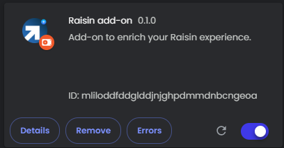

# Raisin add-on Chrome Extension

 &nbsp;

An extension that adds a few things to the [Raisin](https://raisin.com) UI. Works in any Chrome based browser.

_This extension is not affiliated with Raisin._

## What does it to?

Raisin returns your accrued interest in their response body. They do however not show it. This extension does! You can also add a name to your saving accounts. The extension utlilizes [`chrome.storage.sync`](https://developer.chrome.com/docs/extensions/reference/api/storage?hl=nl#property-sync) to sync the names to your other devices.

The extension runs only on specific pages, and re-uses your current authorization context to (once per page visit) retrieve your accounts from the Raisin API. This result contains your interest data. The interest data is then shown in the page.

## How to use

### Install into browser

The easiest way to use the extension is to head to the [Chrome Web Store](https://chromewebstore.google.com/detail/raisin-add-on/babbbcheilomdpnkhecakajnojfbcphg) and install the extension there.

### Run locally

1. Clone/download this repository.
2. Head to your browser and type `chrome://extensions` in the address bar.
3. Click on the button that says `Load unpacked`.
4. Navigate to the folder where you stored the repo (step 1)
5. Select the `src` folder (don't go in it!)
6. The extension is loaded!

Should you want to make changes to the code of the extension, you'll need to update the extension code in Chrome. You can do this on the extensions page by clicking the icon next to the on/off toggle (see image above).
